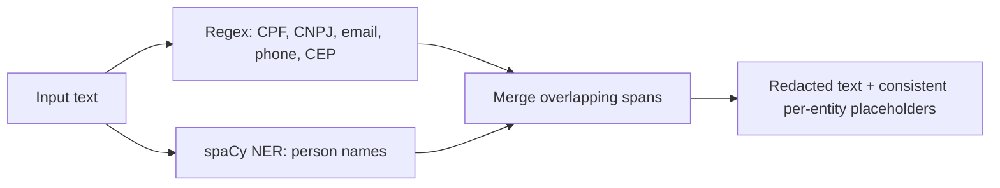

<div align="center">


[](https://github.com/vitormigli/pii-redaction-ptbr/actions/workflows/ci.yml)


</div>

Detects and redacts PII in Portuguese text — CPF, CNPJ, e-mail, phone, CEP (regex)
and person names (local spaCy NER) — before it reaches a log, a prompt, or a
third-party API. Built with LGPD-style data-minimization in mind for a Brazilian
context. Runs entirely on local compute.

## Demo

```bash
docker compose up
```

Streamlit demo at `http://localhost:8501`; API at `http://localhost:8000/docs`.

## Architecture



## Results

12 synthetic sentences, exact-match precision/recall/F1 per entity type. Full
breakdown in [`evals/results.md`](evals/results.md).

| Entity type | Precision | Recall | F1 |
|---|---|---|---|
| CPF | 100.0% | 100.0% | 100.0% |
| CNPJ | 100.0% | 100.0% | 100.0% |
| EMAIL | 100.0% | 100.0% | 100.0% |
| TELEFONE | 100.0% | 100.0% | 100.0% |
| CEP | 100.0% | 100.0% | 100.0% |
| PESSOA (names) | 72.7% | 88.9% | 80.0% |
| **Overall** | **88.0%** | **95.7%** | **91.7%** |

The regex-based entities are perfect on this set, as expected — they have a
parseable shape. Names are the weak point: the small spaCy model false-positives
on capitalized non-name words (`Envie`, sentence-initial) and on company names
(`Acme Ltda`, tagged as a person), and missed one real name entirely. This is the
expected trade-off of `pt_core_news_sm` over the medium/large models — see
Limitations.

## Technical decisions and trade-offs

- **Favor recall over precision on structured PII** (no CPF/CNPJ check-digit
  gating): a missed CPF is a privacy incident, a false positive is an
  over-redacted sentence. Details in
  [`docs/decisions/0001-favor-recall.md`](docs/decisions/0001-favor-recall.md).
- **Regex for structured PII, spaCy NER only for names**: names don't have a
  parseable shape the way a CPF does; everything else does, and regex is faster,
  more precise, and needs no model download.
- **Consistent per-entity placeholders** (`[PESSOA_1]`, `[CPF_1]`, ...) instead of
  a flat `[REDACTED]`: preserves coreference (the same person mentioned twice
  gets the same placeholder), which matters if the redacted text still needs to
  make sense downstream (e.g. sent to an LLM for summarization).

## How to run

```bash
docker compose up
```

Or locally with [`uv`](https://docs.astral.sh/uv/):

```bash
uv sync
uv run python -m spacy download pt_core_news_sm   # one-time, free
make test   # unit tests (regex, merge logic — fake NER, no model download)
make eval   # downloads the spaCy model once, then runs the eval
make run    # starts the API
make demo   # starts the Streamlit demo
make lint
```

## Limitations and next steps

- Small spaCy model (`pt_core_news_sm`) trades some NER accuracy for speed and a
  small download — the medium/large models are a drop-in swap in `ner.py`.
- No address detection beyond CEP — full street addresses aren't a regex-shaped
  problem and would need their own NER pass or a gazetteer.
- Redaction is one-way (placeholders, not reversible tokens) — a use case needing
  to un-redact later would need a mapping store, deliberately left out here.

## Resumo em português

Detecta e mascara dados pessoais em texto em português — CPF, CNPJ, e-mail,
telefone, CEP (via regex) e nomes de pessoas (via NER local com spaCy) — antes que
esse texto chegue a um log, um prompt de LLM ou uma API de terceiros. Pensado com a
LGPD em mente: por padrão prioriza não deixar passar um dado pessoal (recall) mesmo
à custa de algum falso positivo. Roda inteiramente em recursos locais, sem
nenhuma chamada a API paga.
